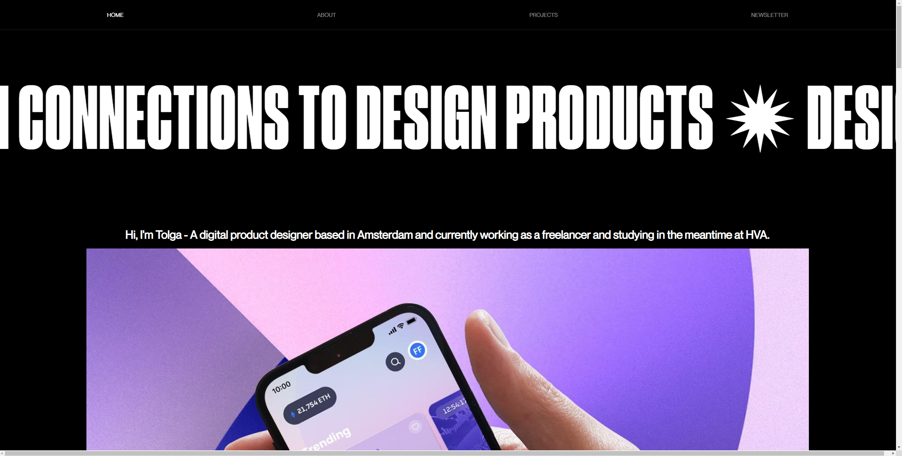
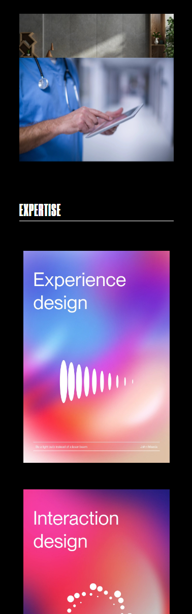
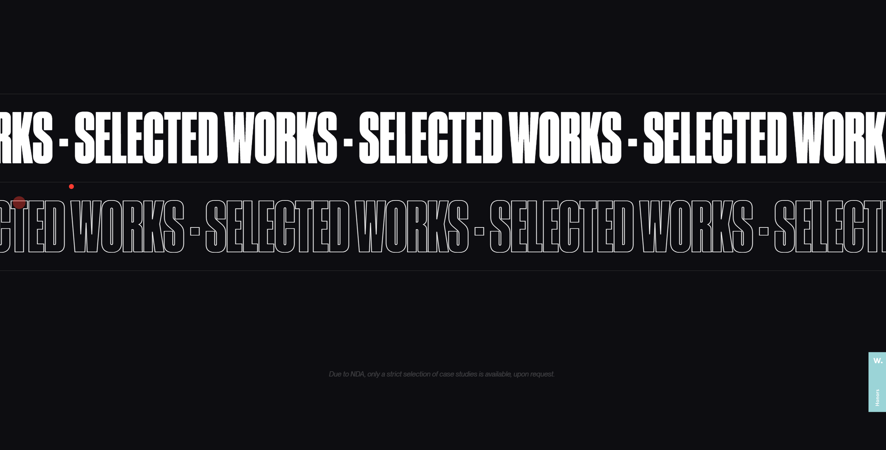
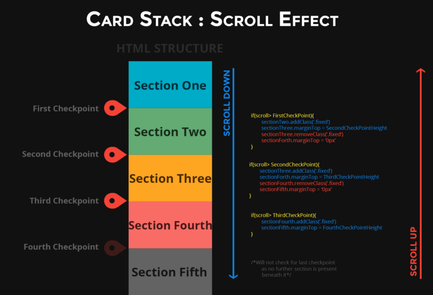

# Procesverslag
Markdown is een simpele manier om HTML te schrijven.  
Markdown cheat cheet: [Hulp bij het schrijven van Markdown](https://github.com/adam-p/markdown-here/wiki/Markdown-Cheatsheet).

Nb. De standaardstructuur en de spartaanse opmaak van de README.md zijn helemaal prima. Het gaat om de inhoud van je procesverslag. Besteedt de tijd voor pracht en praal aan je website.

Nb. Door *open* toe te voegen aan een *details* element kun je deze standaard open zetten. Fijn om dat steeds voor de relevante stuk(ken) te doen.

## Jij

  
uitwerken voor kick-off werkgroep

  ### Auteur:
  Tolga Zorlu  500882795

  #### Je startniveau:
  hier je startniveau (kies uit zwart, rood óf blauw)

  #### Je focus:
  Ik wil mijn focus leggen om de animateis van de site. De site die ik namaak maakt gebruik van marqueu, courasel en fades. 
 

## Je website

  
uitwerken voor kick-off werkgroep

  ### Je opdracht:
  https://www.francescofagioli.me/
  Ik wil deze website namaken. En als ik genoeg tijd overheb nog een extra custom pagine toevoegen in de style van deze site waar ik projecten kan laten zien.

  #### Screenshot(s) van de eerste pagina (small screen): 
  hier de naam van de pagina 
  

  #### Screenshot(s) van de tweede pagina (small screen):
  hier de naam van de pagina  
  
 

## Toegankelijkheidstest 1/2 (week 1)

  
uitwerken na test in 1e werkgroep

  ### Bevindingen
  Lijst met je bevindingen die in de test naar voren kwamen:

  Ik kwam erachter dat de website ook gewoon prima werkt voor mensen met slecht zicht. En voor kleuren blinden was er ook niet veel verschillend gelukkig. De tekst was ook groot genoeg voor mensen die slechtziend zijn. 
  #### Screenreader
  De screenreader werkte wel maar niet altijd werdt de hele zin voorgelezen. sommige stukjes werde ook wel is overgeslagen ik heb het gevoel dat dat komt doordat de website voornamelijk divjes gebruikte. 

  #### Muis en Toetsenbord 
  De site werkt prima als je met muis en toetsenbord kan werke. Ook was het prima voor mobile users. 

  #### Motoriek (shocks, elastiekjes)
  Het ging wat moeilijker, maar het was te doen. Alle knopjes op de site zijn groot en de tekst was nogsteeds leesbaar. 

  #### Visueel (brillen, contrast, kleurenblind, dark/light). 
  De website heeft een zwarte achtergrond maar het was prima zichtbaar. Ik was erg blij met hoe zichtbaar alles bleef. Ook in de avond voelde de site niet heel fel en werkte het gewoon prima. 

## Breakdownschets (week 1)

  
uitwerken na afloop 2e werkgroep

  ### de hele pagina: 
  

  <!-- ### dynamisch deel (bijv menu):  -->

  ### wellicht nog een dynamisch deel (bijv filter): 
  projecten op de home page. 

## Voortgang 1 (week 2)

  
uitwerken voor 1e voortgang

  ### Stand van zaken
  deze week zijn we begonne met het flexbox en grid. Ik vondt dit een erg leuke week en was ook gemotiveerd om een goed begin te maken aan mijn site. Ik heb al een redelijk gedeelte van de header afgekregen. De html heb ik ook allemaal al in me code. 

  ### Agenda voor meeting
  samen met je groepje opstellen
  Ik heb samen met een studenten assistent gekeken naar mijn werk. Hij was al redelijk blij met wat ik al heb gemaakt en heeft mij geholpen bij het mergen van 2 branches waar ik moeite mee had. 

  ### Verslag van meeting
  hier na afloop snel de uitkomsten van de meeting vastleggen

  - Ik had een master en main brain, die we samen hebben gemerged
  - figure tag gebruiken voor een image-container
  - mischien gebruik maken van sections. 

## Voortgang 2 (week 3)

  
uitwerken voor 2e voortgang

  ### Stand van zaken
  Ik heb deze week voornamlijk gekeken naar stack able cards. Kwam alleen maar achter libaries die dit regelen ipv pure css/javascript. Wel kreeg ik hulp van de student assistent met hoe ik dit zou kunnen maken en advies wat ik zou kunne veranderen. 

  ### Agenda voor meeting
  samen met je groepje opstellen

  | student 1      | student 2          | student 3    | student 4        |
  | ---            | ---                | ---          | ---              |
  | dit bespreken  | en dit             | en ik dit    | en dan ik dat    |
  | en dat ook nog | dit als er tijd is | nog een punt | dit wil ik zeker |
  | ...            | ...                | ...          | ...              |

  ### Verslag van meeting
  Je html opschonen. En probeer mischien van classes af te gaan en meer child selectoren te gebruiken. Ik heb de laatste dag nog een beetje hulp gehad van een studenten assistent die ik een bericht had gestuurd over een animatie. 

## Toegankelijkheidstest 2/2 (week 4)

  
uitwerken na test in 8e werkgroep

  ### Bevindingen
  Lijst met je bevindingen die in de test naar voren kwamen (geef ook aan wat er verbeterd is):
  
  De website heeft veel marquee tekst die het selecteren van sommige delen moeilijker kunnen maken. 
  Voor de rest werkt te site prima en zijn alle texte groot genoeg

  #### Screenreader
  Hier korte omschrijving (met indien nodig afbeeldingen)

  Marquee  text vervangen met een div. Want Marquee leest de text namelijk niet en het veroorzaakt problemen met het verder gaan met de screenreader. 

  #### Muis en Toetsenbord 
  Hier korte omschrijving (met indien nodig afbeeldingen)

  Hier een omschrijving van hoe het opgelost kan worden (met indien nodig afbeeldingen)
  Pagina werkt prima 

  Site werkt prima voor mensen met een scherm toetstenbord. maar ook gewoon op mobiel. 

  #### Motoriek (shocks, elastiekjes)
  Hier korte omschrijving (met indien nodig afbeeldingen)
  Het ging wat moeilijker maar lukte nogsteeds wel prima

  Hier een omschrijving van hoe het opgelost kan worden (met indien nodig afbeeldingen)
  Niet echt iets nodig gehad heirvoor. 

  #### Visueel (brillen, contrast, kleurenblind, dark/light). 
  Hier korte omschrijving (met indien nodig afbeeldingen)
  De website is zwart/wit hierdoor was het erg makkelijk om de pagina te bekijken met alle brillen die we hadden. 

  Hier een omschrijving van hoe het opgelost kan worden (met indien nodig afbeeldingen)
  Geen verbetering nodig. De teksten zijn grootgenoeg en geen problemen met kleur.

## Voortgang 3 (week 4)

  
uitwerken voor 3e voortgang

  ### Stand van zaken
  hier dit ging goed & dit was lastig (neem ook screenshots op van delen van je website en code)

  Ik liep vast in de animaties. Dus leek het me verstandig om gewoon beide pagina's te stylen en het animeren voor het laaste te laten. Dat heb ik ook gedaan nu. Ik zal eraan werken nu tot de deadline. 

  ### Agenda voor meeting
  samen met je groepje opstellen

  | student 1      | student 2          | student 3    | student 4        |
  | ---            | ---                | ---          | ---              |
  | dit bespreken  | en dit             | en ik dit    | en dan ik dat    |
  | en dat ook nog | dit als er tijd is | nog een punt | dit wil ik zeker |
  | ...            | ...                | ...          | ...              |

  ### Verslag van meeting
  hier na afloop snel de uitkomsten van de meeting vastleggen

  - maak gebruik van child selectoren
  - Je kan beginne met je css en html opschonen
  - Kreeg codepen/stackoverflow links wat ik kon gebruike voor de animaties

## Eindgesprek (week 5)

  
uitwerken voor eindgesprek

  ### Je uitkomst - karakteristiek screenshots:
  
  Alles is gelukt op 1 animatie na. En die was on scroll animate. Het lukte me niet omdat hij ook in reverse zou moeten kunnnen werken. 

  ### Dit ging goed/Heb ik geleerd: 
  Korte omschrijving met plaatjes

  Ik heb geleerd hoe je cards kan stacken. Ook heb ik geleerd om met marquee's te werken ( ook met outlines). En heb ik ook mogen animaten met opacity's/javascript class add en remove. 
  

  ### Dit was lastig/Is niet gelukt:
  Korte omschrijving met plaatjes

  On scroll animation die ook in reverse werkt als je terug omhoog scrolled. 
  Ook is het me niet gelukt om een custom cursor te designen
  wel had ik een video gevonden ervoor alleen niet genoeg tijd voor de deadline 
  https://www.youtube.com/watch?v=B5qepgwIZxA&t=26s 
  

## Eindgesprek Herkansing

  
uitwerken voor eindgesprek

  ### Verbeter punten voor de herkansing
  - JavaScript is wat wonky
  - HTML is voorzien van veel divjes, relatief, dus ze zijn wel functioneel, maar alle andere tags lijken een beetje weggevaagd te zijn, structuur met main/header mag ook beter.
  - Eigenlijk wil ik wel gewoon wat meer content zien.
  - Procesverslag is aanwezig.

  ### Wat heb ik gedaan voor de herkansing
  Voor de herkansing heb ik mijn menu veranderd in een sticky hamburger menu.
  Ik heb ook een extra pagina erbij gebouwd met een grid layout via waar je naar de project details zou kunnen gaan.
  Ook heb ik een contact formulier onderaan mijn pagina's toegevoegd. 
  Ik ben ook gaan kijken naar een verandering voor de divjes alleen kwam ik met sections en spans niet veel verder omdat deze de marqueu breken. 

## Bronnenlijst

  
continu bijhouden terwijl je werkt

  Nb. Wees specifiek ('css-tricks' als bron is bijv. niet specifiek genoeg).

  1. https://codepen.io/robinrendle/pen/LYNVpPX/a10a07290f047c4f553850f17e0c5c44
    Dit is een codepen die ik gebruikt heb om stacking cards mee te maken. 
    ook heb ik gebruik gemaakkt van 
  2. https://medium.com/@sanjeevy133/card-stack-scroll-effect-486cc3b55312 
    Van deze pagina. Hier legen ze je uit hoe het stacking effect werkt. Doormiddel van de uitleg hier over position sticky ect begon ik het te begrijpen. 
      
  3. https://codepen.io/hexagoncircle/pen/eYMrGwW 
    Ik had eerst marquee html tag gebruikt voor het sliding effect op de text. Ik kreeg het advies van een studentassistent om gebruik te maken van deze methode omdat marquee niet zo goed semantisch meer is. 
    Ik maak op dit moment gebruik van de div methoden. Dat komt omdat ik wel wrappers nodig had en heir tussen een span of een div moest gaan kiezen. Zoals u ziet wordt dat ook hier gedaan.  

  4. https://codepen.io/bstonedev/pen/MWWZgKz
    Deze pagina maakt gebruik van on scroll animation dit heb ik gebruikt voor mijn about page. Wel heb ik het moeten aanpassen en heb ik ook gebruik gemaakt van de volgende codepen om dit inelkaar te zetten. 

  5. https://codepen.io/ricardospalves/pen/JpOmMR?editors=1111
    Deze heeft ook een soort effect zoals de stacking cards alleen moest er nog wel behoorlijk wat veranderd worden. Ik heb de javascript die ik tegen kwam hiervoor (bron 4) aangepassed en gebruikt. ik heb er een extra functie bij geschreven die ook het deleten van de layers achterop. Alleen werkt het nog niet hellemaal zoals ik wou. 

