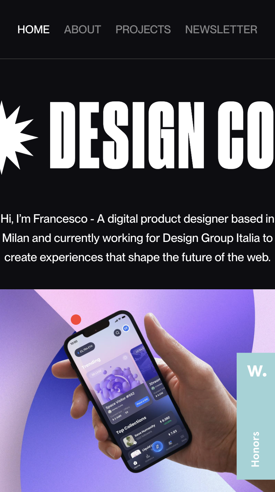

# Procesverslag
Markdown is een simpele manier om HTML te schrijven.  
Markdown cheat cheet: [Hulp bij het schrijven van Markdown](https://github.com/adam-p/markdown-here/wiki/Markdown-Cheatsheet).

Nb. De standaardstructuur en de spartaanse opmaak van de README.md zijn helemaal prima. Het gaat om de inhoud van je procesverslag. Besteedt de tijd voor pracht en praal aan je website.

Nb. Door *open* toe te voegen aan een *details* element kun je deze standaard open zetten. Fijn om dat steeds voor de relevante stuk(ken) te doen.

## Jij

  
uitwerken voor kick-off werkgroep

  ### Auteur:
  Tolga Zorlu  500882795

  #### Je startniveau:
  hier je startniveau (kies uit zwart, rood óf blauw)

  #### Je focus:
  Ik wil mijn focus leggen om de animateis van de site. De site die ik namaak maakt gebruik van marqueu, courasel en fades. 
 

## Je website

  
uitwerken voor kick-off werkgroep

  ### Je opdracht:
  https://www.francescofagioli.me/
  Ik wil deze website namaken. En als ik genoeg tijd overheb nog een extra custom pagine toevoegen in de style van deze site waar ik projecten kan laten zien.

  #### Screenshot(s) van de eerste pagina (small screen): 
  hier de naam van de pagina 
  

  #### Screenshot(s) van de tweede pagina (small screen):
  hier de naam van de pagina  
  
 

## Toegankelijkheidstest 1/2 (week 1)

  
uitwerken na test in 1e werkgroep

  ### Bevindingen
  Lijst met je bevindingen die in de test naar voren kwamen:

  Ik kwam erachter dat de website ook gewoon prima werkt voor mensen met slecht zicht. En voor kleuren blinden was er ook niet veel verschillend gelukkig. De tekst was ook groot genoeg voor mensen die slechtziend zijn. 
  #### Screenreader
  De screenreader werkte wel maar niet altijd werdt de hele zin voorgelezen. sommige stukjes werde ook wel is overgeslagen ik heb het gevoel dat dat komt doordat de website voornamelijk divjes gebruikte. 

  #### Muis en Toetsenbord 
  De site werkt prima als je met muis en toetsenbord kan werke. Ook was het prima voor mobile users. 

  #### Motoriek (shocks, elastiekjes)
  Het ging wat moeilijker, maar het was te doen. Alle knopjes op de site zijn groot en de tekst was nogsteeds leesbaar. 

  #### Visueel (brillen, contrast, kleurenblind, dark/light). 
  De website heeft een zwarte achtergrond maar het was prima zichtbaar. Ik was erg blij met hoe zichtbaar alles bleef. Ook in de avond voelde de site niet heel fel en werkte het gewoon prima. 

## Breakdownschets (week 1)

  
uitwerken na afloop 2e werkgroep

  ### de hele pagina: 
  

  <!-- ### dynamisch deel (bijv menu):  -->

  ### wellicht nog een dynamisch deel (bijv filter): 
  projecten op de home page. 

## Voortgang 1 (week 2)

  
uitwerken voor 1e voortgang

  ### Stand van zaken
  deze week zijn we begonne met het flexbox en grid. Ik vondt dit een erg leuke week en was ook gemotiveerd om een goed begin te maken aan mijn site. Ik heb al een redelijk gedeelte van de header afgekregen. De html heb ik ook allemaal al in me code. 

  ### Agenda voor meeting
  samen met je groepje opstellen
  Ik heb samen met een studenten assistent gekeken naar mijn werk. Hij was al redelijk blij met wat ik al heb gemaakt en heeft mij geholpen bij het mergen van 2 branches waar ik moeite mee had. 

  ### Verslag van meeting
  hier na afloop snel de uitkomsten van de meeting vastleggen

  - Ik had een master en main brain, die we samen hebben gemerged
  - figure tag gebruiken voor een image-container
  - mischien gebruik maken van sections. 

## Voortgang 2 (week 3)

  
uitwerken voor 2e voortgang

  ### Stand van zaken
  hier dit ging goed & dit was lastig (neem ook screenshots op van delen van je website en code)

  ### Agenda voor meeting
  samen met je groepje opstellen

  | student 1      | student 2          | student 3    | student 4        |
  | ---            | ---                | ---          | ---              |
  | dit bespreken  | en dit             | en ik dit    | en dan ik dat    |
  | en dat ook nog | dit als er tijd is | nog een punt | dit wil ik zeker |
  | ...            | ...                | ...          | ...              |

  ### Verslag van meeting
  hier na afloop snel de uitkomsten van de meeting vastleggen

  - punt 1
  - punt 2
  - nog een punt
- ...

## Toegankelijkheidstest 2/2 (week 4)

  
uitwerken na test in 8e werkgroep

  ### Bevindingen
  Lijst met je bevindingen die in de test naar voren kwamen (geef ook aan wat er verbeterd is):

  #### Screenreader
  Hier korte omschrijving (met indien nodig afbeeldingen)

  Hier een omschrijving van hoe het opgelost kan worden (met indien nodig afbeeldingen)

  #### Muis en Toetsenbord 
  Hier korte omschrijving (met indien nodig afbeeldingen)

  Hier een omschrijving van hoe het opgelost kan worden (met indien nodig afbeeldingen)

  #### Motoriek (shocks, elastiekjes)
  Hier korte omschrijving (met indien nodig afbeeldingen)

  Hier een omschrijving van hoe het opgelost kan worden (met indien nodig afbeeldingen)

  #### Visueel (brillen, contrast, kleurenblind, dark/light). 
  Hier korte omschrijving (met indien nodig afbeeldingen)

  Hier een omschrijving van hoe het opgelost kan worden (met indien nodig afbeeldingen)

## Voortgang 3 (week 4)

  
uitwerken voor 3e voortgang

  ### Stand van zaken
  hier dit ging goed & dit was lastig (neem ook screenshots op van delen van je website en code)

  ### Agenda voor meeting
  samen met je groepje opstellen

  | student 1      | student 2          | student 3    | student 4        |
  | ---            | ---                | ---          | ---              |
  | dit bespreken  | en dit             | en ik dit    | en dan ik dat    |
  | en dat ook nog | dit als er tijd is | nog een punt | dit wil ik zeker |
  | ...            | ...                | ...          | ...              |

  ### Verslag van meeting
  hier na afloop snel de uitkomsten van de meeting vastleggen

  - punt 1
  - punt 2
  - nog een punt
  - ...

## Eindgesprek (week 5)

  
uitwerken voor eindgesprek

  ### Je uitkomst - karakteristiek screenshots:
  

  ### Dit ging goed/Heb ik geleerd: 
  Korte omschrijving met plaatjes

  

  ### Dit was lastig/Is niet gelukt:
  Korte omschrijving met plaatjes

  

## Bronnenlijst

  
continu bijhouden terwijl je werkt

  Nb. Wees specifiek ('css-tricks' als bron is bijv. niet specifiek genoeg).

  1. bron 1
  2. bron 2
  3. ...

